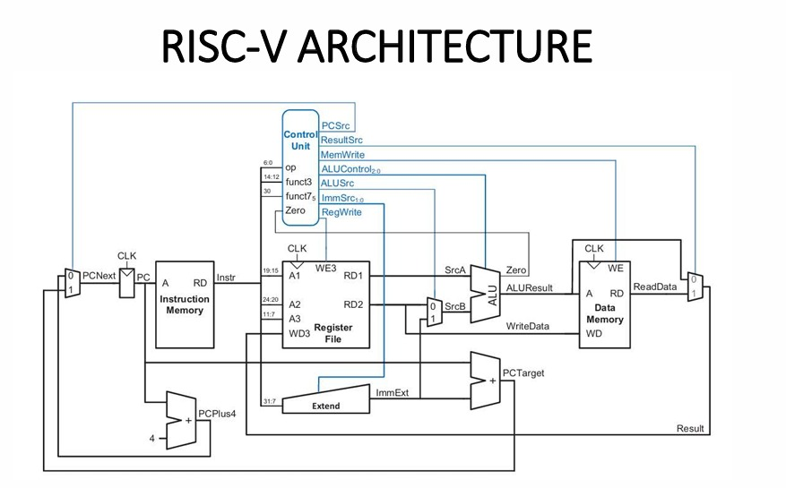

# RISC-V Core Processor (RV32I)

## Overview

This project implements a single-cycle RV32I RISC-V processor using Verilog HDL. It was developed to understand the complete RISC-V processor architecture, including instruction fetch, decode, execute, memory access, and write-back stages, along with the software-to-hardware execution flow.

---

## Features

- Single-cycle RV32I processor
- Verilog HDL implementation
- Modular RTL design
- Functional verification using a Verilog testbench
- Software program developed in C
- Generated RISC-V assembly to understand instruction execution
- Waveform-based simulation and verification

---

## Folder Structure

**rtl/**
- RTL source files for the RISC-V processor

**software/**
- C source program
- Generated RISC-V assembly 

**testbench/**
- Verilog testbench for processor verification

**docs/**
- Processor block diagram
- Simulation waveform

---

## Tools Used

- Verilog HDL
- Xilinx Vivado
- Visual Studio Code (VS Code)
- GNU RISC-V Toolchain

---

## Documentation

### Processor Block Diagram

### Simulation Waveform

---

## Author

**Konda Harini**
